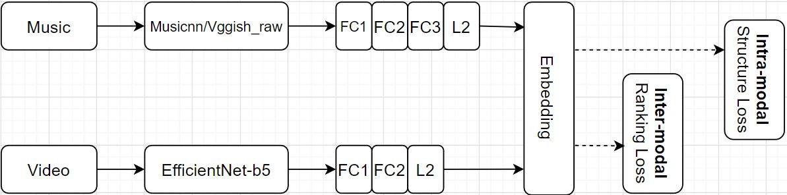
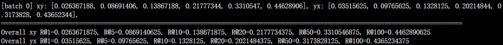

Cross-modal Retrieval between Music and Video
====

# Prerequisites
* [Python 3.7](https://www.python.org/downloads/)
* [Pytorch 1.7](https://pytorch.org/get-started/locally/) (for feature_extractor/torchvggish)
* [Tensorflow 2.2](https://www.tensorflow.org/install)
* [librosa](https://librosa.org/doc/latest/index.html)

# Description

## project structure
```
├── feature_extractor
    ├── musicnn
    └── torchvggish
├── VM-NET-Musicnn
└── VM-NET-Vggish_raw
```
The Video-Music Retrival Network(VM-NET) is devided into two versions(i.e.VM-NET-Musicnn and VM-NET-Vggish_raw). Each version is the same except the audio features are extracted from two different audio feature extractors. The two different audio feature extractors(i.e.[Musicnn](https://github.com/jordipons/musicnn/blob/master/musicnn_example.ipynb) and [Vggish_raw](https://github.com/harritaylor/torchvggish)) are embeded in `./feature_extractor`. All feature extractors are secondarily developed so you may **understand the principle by reading the original repo** but YOU CAN ONLY SMOOTHLY RUN THE VM-NET **USING THE EMBEDED VERSION IN THIS REPO!!!**

## Network structure


# Usage
## 1.Prepare the raw file of audio and video like .mp3, .wav, mp4

## 2.Extract Features:

### audio_feature:
In this project, **several fully-connected layers in the offical Vggish architecture released by Google are cut because they compress too much information. Only CNN+MaxPooling blocks are reserved**. The model only extract the feature of **the first 1 minute audio** so for each audio the shape of extracted feature is fixed, i.e.`(62, 512, 6, 4) = (frame_num, feature_dims, height, width)`. 

For musicnn, we use `MSD_musicnn_big` in [Musicnn](https://github.com/jordipons/musicnn/tree/master/musicnn/musicnn) to extract features.(All model checkpoints have been embeded in this repo so you donnot need to clone any other repos) We also add constraint that only **the first 5 minute audio** will be extracted. The max output size is `(100, 500) = (frame_num, feature_dims)`
#### vgg_raw:
```bash
cd feature_extractor/torchvggish/torch_vggish/
python extract_vgg_pool.py --audio_dir --save_dir --gpu_idx    # Output feature Shape per song = (62, 512, 6, 4)
```
#### musicnn:
```shell
cd feature_extractor/musicnn/
python extract_musicnn_big.py --audio_dir --save_dir    # Output feature Shape per song = (60, 500)
```
#### tip: Since the feature extraction is very time-consuming, you could write a shell script yourself and use `nohup python -u` to put the task at backend for convenience.
### video_feature:
Please read section 3 in [efficientnet](https://github.com/tensorflow/tpu/tree/master/models/official/efficientnet) carefully and clone this repo. 
Please extract feat by running:
```python
import efficientnet_builder
features, endpoints = efficientnet_builder.build_model_base(images, 'efficientnet-b5')
# Output feature Shape = (60, 2048)
```
We use EfficientNet-b5 for feature extraction. The output feature shape is `(frame_num, 2048)`. 
If you use a different visual feature extractor with different feature_dim(i.e. not equal to 2048) Please change the `net_opts.y_dim` parameter in `train.py` and `test.py` accordingly.
## 3.Data Preparation:
### Feature Directory Structure
1. Please organize features from the above extractors like below:
```text
├── train_data_dir
    ├── audio
        └──features of audio stored in id.npy format 
    └── video
        └──features of video stored in id.npy format 
├── test_data_dir
    ├── audio
        └──features of audio stored in id.npy format 
    └── video
        └──features of video stored in id.npy format 
```
2.Prepare **train Dataframe** and test **Dataframe yourself** like below and save them into csv format:
| id |
| :------------:|
| id_1|
| id_2|
| id_3|
| id_4|
...      
## 4.Training and Testing
Please set path configs like `train_data_dir`, `train_csv_dir` in `train.py` and `test.py`. `summaries_dir` is where the tensorboard animation files and **model checkpoint** will be saved. which is important.
```shell
python train.py # to train a model.
python test.py # to test a trained model.
```
IMPORTANT: The version of VM-NET you want to run and the audio feature extractor you use should be consistent!!!
## 5.Emedding Extraction and Deployment API
The embedding process has been sealed into a Class Object for you to deploy this model using Web Frameworks like Flask. To extract embeddings for unknown music and video musicnn/vggish_raw features:
* Edit the `model_path` in `embedding.py` to the `summaries_dir` of a model
* The `extract_emb.py` shows a pipeline for deployment. It shows accepted inputs' shape and print the output embedding's shape if everything goes well.
tip: you can input single sample for embedding extraction. If you want to extract in a batch format, you have to batchify youself.

```python
embed_loader = Embedding()

# x is a list with x[0] refers to all music features and x[1] refers to all video features
embeddings = embed_loader(x)
print(embeddings[0].shape) # audio embedding
print(embeddings[1].shape) # video embedding
```


# Results
In this paper, Recall@K is the protocal to evaluate the cross-modal retrival performance. For each music/video sample, we calculate its cosine distance to all video/music in a minibatch. If the correct cross-modal sample is in the those with top K shortest distances, It means the retrival is successfully. Therefore, we only care about Recall@1, Recall@5 and Recall@10 because bigger K is meaningless. Recall_xy means query by music/audio where Recall_yx means query by video.


# Acknowoledge
This repo is a refined version of [VM-NET](https://github.com/csehong/VM-NET). In this repo, the code is incomplete and cannot be compiled successfully because of the lack of dataiter and other key model scripts. I complete the older version in this refined one. Also the feature extraction is hand-crafted features like MFCC/Chroma_stft and other statistical features. It is proved that musicnn and vggish are better features for audio. Moreover, the video-feature extractor, Inception Network is repalced by more modern one, EfficientNet-b5. Finally, since the old version use TF 0.12.0 which is a very old and slow version, adaptation to TF 2.0 has been made to this one.

# Reference
 - [Content-Based Video–Music Retrieval Using Soft Intra-Modal Structure Constraint](https://arxiv.org/abs/1704.06761)
 - [EfficientNet: Rethinking Model Scaling for Convolutional Neural Networks](https://arxiv.org/abs/1905.11946)
 - [Audio Set: An ontology and human-labeled dataset for audio events](https://ieeexplore.ieee.org/document/7952261?denied=)
 - [CNN ARCHITECTURES FOR LARGE-SCALE AUDIO CLASSIFICATION](https://arxiv.org/pdf/1609.09430.pdf)
 - [musicnn: Pre-trained convolutional neural networks for music audio tagging](https://arxiv.org/abs/1909.06654)


